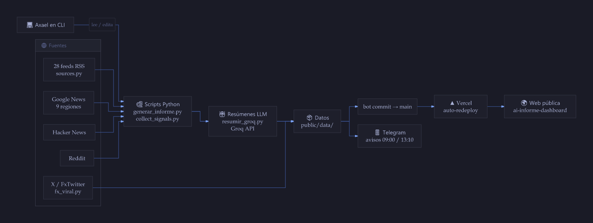
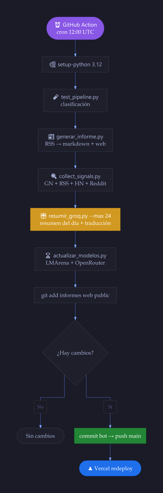
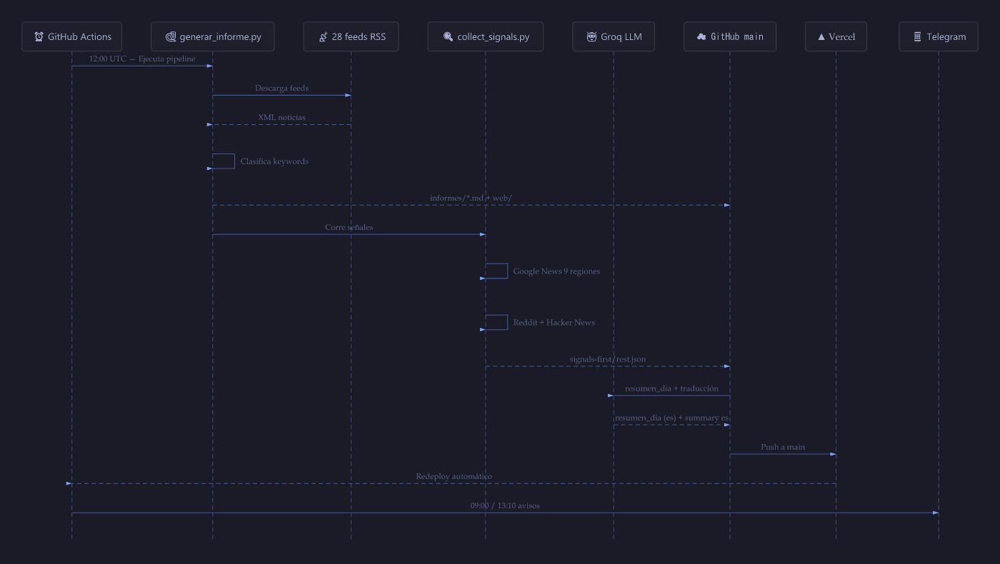
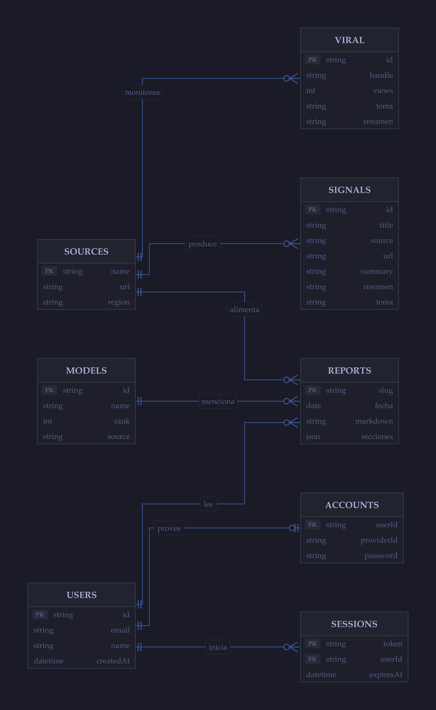
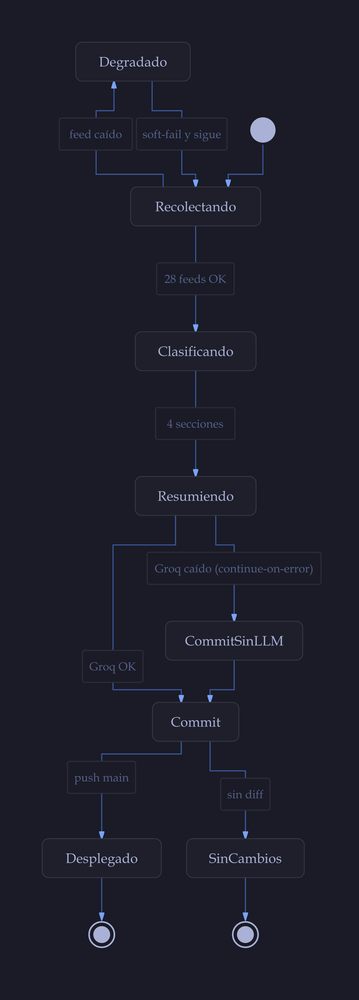

# AI Informe

Recopilación **diaria y automática** de noticias de IA (novedades, usos reales, economía, señales de futuro y seguridad). Python + GitHub Actions, publicado en Vercel.

[](https://github.com/traderxael/AI-Informe-/actions)
[](https://github.com/traderxael/AI-Informe-/commits/main)
[](LICENSE)
[](https://ai-informe-dashboard.vercel.app)

## Ver el dashboard

| Entorno | URL |
|--------|-----|
| Producción | [ai-informe-dashboard.vercel.app](https://ai-informe-dashboard.vercel.app) |
| Repositorio | [github.com/traderxael/AI-Informe-](https://github.com/traderxael/AI-Informe-) |

## Qué hace de verdad

- RSS públicos (labs, medios, Google News multi-país, HN, Reddit con degradación suave). 34 feeds vivos, auditados con `scripts/auditar_feeds.py`.
- Informe markdown diario en `informes/YYYY-MM-DD.md`.
- JSON para la web: `public/data/signals-first.json`, `signals-rest.json`, `modelos.json`.
- Ranking de modelos: Elo LMArena × precios OpenRouter (job del cron, no bloquea si falla).
- **Resúmenes LLM en español** con Groq (`scripts/resumir_groq.py`, Secret `GROQ_API_KEY`): resumen del día + traducción de señales. Opcional: si no hay key o Groq cae, el informe sigue publicándose.
- **Señales de X (Twitter)**: `scripts/fx_viral.py` monitorea 17 cuentas + 5 búsquedas de nicho vía FxTwitter API → `datos/fx_viral_YYYY-MM-DD.json` (top-40 por views, agrupado por tema). Es también la cola de contenido para clips de AutoClip.
- La portada **carga esas señales**, no una semana congelada.

X / Instagram / TikTok / Xiaohongshu: para X ya hay monitor propio (`fx_viral.py`); el resto requiere levantar RSSHub local (`docker/rsshub`) y `social_sources.json`.

## Arquitectura

<details>
<summary>Ver diagramas (arquitectura, pipeline diario, modelo de datos, corrida y estados)</summary>

### Flujo general



### Pipeline diario (cron 12:00 UTC)



### Corrida completa paso a paso



### Modelo de datos



### Estados de una corrida



</details>

Vectoriales editables en [`docs/diagramas/svg/`](docs/diagramas/svg/) y código Mermaid en [`docs/diagramas/`](docs/diagramas/) (`*.mmd`) para regenerar o re-tematizar.

## Estructura

```
scripts/
  sources.py              # lista única de feeds (única fuente de verdad)
  generar_informe.py      # RSS → markdown + web/  (gzip-safe, reintentos con backoff)
  collect_signals.py      # Google News + RSS + HN + Reddit → public/data/signals-*.json
  fx_viral.py             # X/Twitter vía FxTwitter → datos/fx_viral_*.json
  resumir_groq.py         # resúmenes LLM en español (Groq) + traducción de señales
  actualizar_modelos.py   # LMArena + OpenRouter → public/data/modelos.json
  auditar_feeds.py        # diagnóstico: cuántos items trae cada feed (herramienta)
  test_pipeline.py        # tests sin red (44 tests)
  with-app-env.brace-regression.test.mjs # regresión del wrapper en Windows
informes/                 # un markdown por día
datos/                    # JSON diario de señales de X (cola de clips AutoClip)
public/data/              # JSON que consume la web
web/                      # HTML generado de los markdown (versión estática legada)
docs/diagramas/           # diagramas Mermaid: *.mmd + svg/ + png/
.github/workflows/informe-diario.yml
```

## Uso local

```bash
python scripts/test_pipeline.py     # 44 tests, sin red
python scripts/generar_informe.py    # RSS → informes/*.md + web/
python scripts/collect_signals.py    # señales Google News + HN + Reddit
python scripts/fx_viral.py           # señales de X (o --local con FxEmbed propio)
python scripts/actualizar_modelos.py --max 60
python scripts/auditar_feeds.py      # cobertura real de los 34 feeds (cuántos items trae cada uno)
```

Web (si usás el frontend TanStack):

```bash
npm install && npm run dev
```

## GitHub Actions

- `ci.yml`: ejecuta en cada PR y en `main` `npm ci`, lint, typecheck, tests y build.
- `informe-diario.yml`: cron `0 12 * * *` (09:00 Chile) o manual con `workflow_dispatch`. Pasos, todos con `continue-on-error` donde corresponde:

1. Tests de clasificación (`test_pipeline.py`)
2. Generar informe (markdown + web)
3. Recolectar signals (Google News + RSS + Reddit + HN, máx. 40 traducciones)
4. Resúmenes LLM (Groq) — requiere Secret `GROQ_API_KEY`
5. Ranking de modelos (LMArena + OpenRouter)
6. **Señales de X (FxTwitter)** — 17 cuentas + 5 búsquedas de nicho
7. Commit a `main` (`informes`, `web`, `public`, `datos`) → Vercel redeploy

Si el push a `main` falla por required checks, el job `generar` no puede ser un status check obligatorio sobre sí mismo: desactivalo o permití bypass a `github-actions[bot]`.

## Licencia

MIT — ver [LICENSE](LICENSE).
